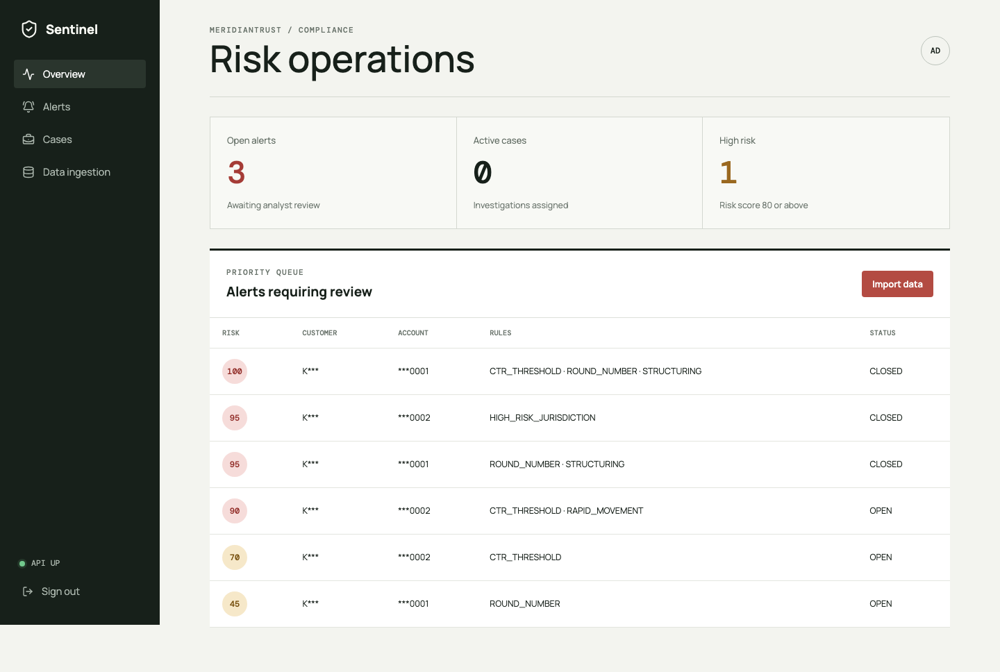

# Sentinel AML

Working hackathon prototype for real-time anti-money laundering monitoring. It imports reference and transaction data, evaluates configurable rules, prioritizes explainable alerts, and records case dispositions with an immutable audit trail.

## Demo



See the [mobile dashboard screenshot](docs/demo/dashboard-mobile.png) for the responsive layout.

## Project structure

```text
src/main/java/com/sentinel/aml/       Spring Boot backend
src/main/resources/db/migration/      Flyway database migrations
frontend/                             React analyst dashboard
data/import/                          Supplied and synthetic CSV fixtures
docs/                                 Problem statement, architecture, and ERD
compose.yml                           PostgreSQL development service
```

## Local development

The default `dev` profile uses an embedded H2 database in PostgreSQL compatibility mode, so Docker is not required.

Set local credentials and start the backend:

```sh
export SENTINEL_ADMIN_USERNAME=admin
export SENTINEL_ADMIN_PASSWORD='<choose-a-password>'
export SENTINEL_ANALYST_USERNAME=analyst
export SENTINEL_ANALYST_PASSWORD='<choose-a-password>'
mvn spring-boot:run
```

Start the frontend in another terminal:

```sh
cd frontend
npm install
npm run dev
```

Open:

- Dashboard: <http://localhost:5173>
- API status: <http://localhost:8080/api/v1/system/status>
- Swagger UI: <http://localhost:8080/swagger-ui.html>

Use the credentials exported above. Administrators can import data and tune rules; analysts have alert and investigation access. No password is committed to source control.

## PostgreSQL profile

PostgreSQL 17.11 and all Flyway migrations were verified locally. With Docker, start PostgreSQL and run without the `dev` profile:

```sh
docker compose up -d postgres
SPRING_PROFILES_ACTIVE=default \
DB_URL=jdbc:postgresql://localhost:5432/sentinel \
DB_USERNAME=sentinel \
DB_PASSWORD='<database-password>' \
SENTINEL_ADMIN_USERNAME=admin \
SENTINEL_ADMIN_PASSWORD='<admin-password>' \
SENTINEL_ANALYST_USERNAME=analyst \
SENTINEL_ANALYST_PASSWORD='<analyst-password>' \
mvn spring-boot:run
```

Use environment variables or a secrets manager for credentials. `compose.yml` refuses to start until `DB_PASSWORD` is supplied.

## CSV ingestion

The customer and account files are reference data and must be imported in this order:

1. `customers.csv` into the `customers` table.
2. `accounts.csv` into the `accounts` table using `customer_id` to resolve ownership.
3. Synthetic or supplied transactions into the `transactions` table using `account_id`.

The supplied files and a synthetic transaction set are in `data/import/`. Upload them from the dashboard in order or use these endpoints:

```text
POST /api/v1/ingestion/customers/csv
POST /api/v1/ingestion/accounts/csv
POST /api/v1/ingestion/transactions/csv
POST /api/v1/transactions
```

CSV columns must be mapped to the external identifiers used in the migration rather than relying on generated database IDs.

Incremental transactions can be posted as JSON to `POST /api/v1/transactions`. Imports are idempotent by external transaction ID, malformed rows are reported, and unknown account/customer references are rejected.

## Detection rules

The synchronous detection engine implements:

- INR-normalized reporting threshold
- Three just-below-threshold transactions in 24 hours
- At least 80% rapid outward movement within 48 hours
- Configurable high-risk jurisdictions and counterparties
- Three-times historical daily average deviation
- Repeated round-number activity

Configure rule switches, thresholds, windows, country codes, counterparties, and exchange rates under `sentinel.rules` in `src/main/resources/application.yml`, through environment variables, or at runtime through the ADMIN-only `GET/PUT /api/v1/rules` endpoint. Runtime changes are audited. Alerts aggregate by account, matched rules, and UTC day.

## Demo walkthrough

1. Start the backend and frontend.
2. Sign in using the administrator credentials exported before startup.
3. Open **Data ingestion** and select the three files from `data/import/`.
4. Click **Import and run detection**.
5. Open a high-risk alert to inspect its explanation and transaction evidence.
6. Create an investigation case.
7. Open **Cases**, then close and escalate the case.
8. Confirm the alert remains retained as `CLOSED`; administrators can inspect `/api/v1/audit-events`.

The included transaction data generates threshold, structuring, rapid-movement, high-risk jurisdiction, and round-number detections.

See [docs/architecture.md](docs/architecture.md) for the ERD and processing flow, and [docs/problem-statement.md](docs/problem-statement.md) for the challenge requirements.

## Validation

```sh
mvn test
cd frontend && npm run lint && npm run build
```

Run the opt-in 10,000-transaction benchmark with:

```sh
mvn -Dtest=BulkPerformanceIT test
```

Latest final-code result: **75.82 seconds**, below the required 120-second target. The regular suite contains 17 tests covering rules, ingestion, API errors, RBAC, runtime configuration, case/audit workflow, and concurrent duplicate handling. See [docs/verification.md](docs/verification.md) for the verification record.