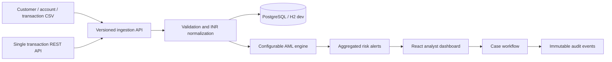
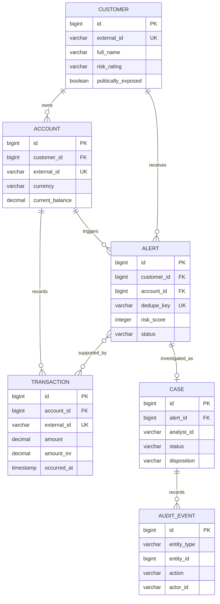

# Sentinel Architecture

## Request flow

## Entity relationships

## Detection model

Every ingested transaction is normalized to INR and evaluated synchronously. Matching rules contribute evidence and a score. The final score is the highest rule score plus five points for each additional match, capped at 100. A unique account/rule/day key aggregates repeated alerts while retaining all evidence.

Rule thresholds and exchange rates are configured under `sentinel.rules` in `application.yml` and can be overridden with environment variables.

## Security and privacy

- `ADMIN`: CSV ingestion, transactions, alerts, cases, and audit events.
- `INGESTOR`: streaming transaction endpoint.
- `ANALYST`: alert and case endpoints.
- List views mask customer names; authenticated alert details reveal the full synthetic identity.
- Closed alerts are retained. Case transitions append audit events and no delete endpoint is provided.